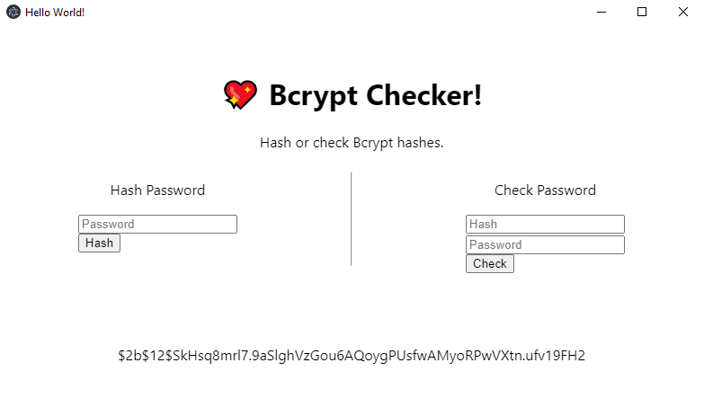

---
**Bcrypt Checker** is a tool to check and generate Bcrypt Hashes.

---

* Check if a String matches a given Hash
* Generate a Bcrypt Hash

# Commands
| Command          | Description |
|------------------|-------------|
| `npm start`      | Runs the server in development configuration.
| `npm run make`   | Builds the production assets.
